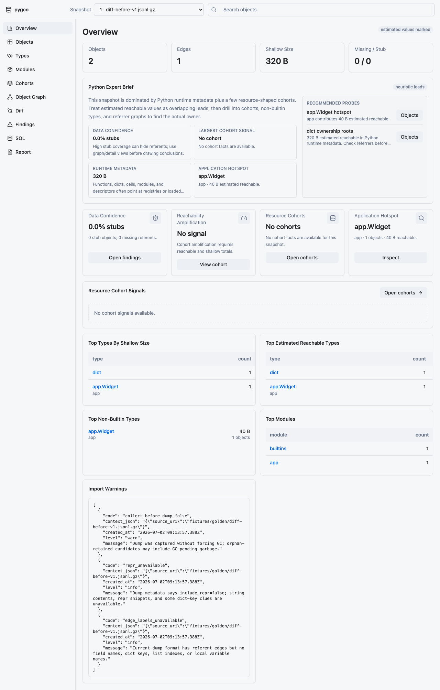

# py-gc-objects-analyze

`py-gc-objects-analyze` is a local Python GC object memory forensics toolkit. It helps you collect low-impact heap object dumps from Python processes, import them into a temporary SQLite analysis database, and inspect object growth, references, diffs, and investigation leads through the `pygco` CLI or local Web UI.

The short version:

```text
Python process
  -> pygco-dump writes gzip JSONL
  -> pygco imports and indexes it locally
  -> CLI / local Web UI helps investigate memory growth
```



## When To Use It

Use `pygco` when you need to investigate:

- Python service memory growth.
- Suspicious caches, queues, connection pools, or async backlogs.
- Before/after object count and size deltas.
- Object referents, referrers, and bounded local reference graphs.
- Heuristic findings that can guide a deeper memory investigation.

It is not a remote profiler, hosted SaaS, authorization layer, or long-term database. SQLite analysis files are rebuildable cache artifacts; keep the original dump files as durable evidence.

## Install

Install the `pygco` CLI from GitHub Releases:

```bash
curl -fsSL https://github.com/ivan-94/py-gc-objects-analyze/releases/latest/download/install.sh | sh
```

The installer places `pygco` in `$HOME/.local/bin` by default. Use `PYGCO_INSTALL_DIR` to choose another directory:

```bash
curl -fsSL https://github.com/ivan-94/py-gc-objects-analyze/releases/latest/download/install.sh | PYGCO_INSTALL_DIR=/usr/local/bin sh
```

Install the Python dump producer in the Python environment that runs your service:

```bash
python -m pip install "pygco-dump[fastapi]"
```

Manual install, source builds, upgrade, uninstall, and release verification are covered in [docs/install.md](docs/install.md).

## First Analysis

After installing `pygco`, run a fixture analysis from this repository:

```bash
pygco open fixtures/golden/tiny-v1.jsonl.gz --no-browser
```

Open the printed local URL. For repeatable CLI analysis:

```bash
pygco import fixtures/golden/diff-before-v1.jsonl.gz fixtures/golden/diff-after-v1.jsonl.gz -o analysis.sqlite --rebuild
pygco summary analysis.sqlite
pygco diff analysis.sqlite --from 1 --to 2
pygco report analysis.sqlite --format markdown
```

## FastAPI Producer Example

Add a dump endpoint inside the process you want to inspect:

```python
from fastapi import FastAPI
from pygco_dump.fastapi import gc_heap_dump_route

app = FastAPI()
app.add_api_route(
    "/debug/gc-heap-dump",
    gc_heap_dump_route(),
    methods=["GET"],
)
```

Collect two dumps and open them locally:

```bash
curl -o before.jsonl.gz "http://service/debug/gc-heap-dump?collect=false"
curl -o after.jsonl.gz "http://service/debug/gc-heap-dump?collect=false"
pygco open before.jsonl.gz after.jsonl.gz
```

Do not expose dump endpoints to untrusted users. Dumps can contain sensitive object metadata, and `collect=true` may affect service latency. Read [docs/runtime-safety.md](docs/runtime-safety.md) and [docs/producer-integration.md](docs/producer-integration.md) before using this in a shared or production environment.

## Documentation

- [Quickstart](docs/quickstart.md)
- [Install and build](docs/install.md)
- [Python producer integration](docs/producer-integration.md)
- [CLI reference](docs/cli.md)
- [Generated CLI help](docs/generated/cli-help.md)
- [Local API reference](docs/api.md)
- [Web UI walkthrough](docs/web-ui-walkthrough.md)
- [Demo transcript](docs/demo.md)
- [Runtime safety](docs/runtime-safety.md)
- [Known limitations](docs/known-limitations.md)
- [Troubleshooting](docs/troubleshooting.md)
- [Versioning](docs/versioning.md)
- [Compatibility](docs/compatibility.md)
- [Testing](docs/testing.md)

## Project Status

The first public release is `0.1.0` and is intentionally local-first:

- `pygco-dump` writes gzip JSONL dumps and framework helpers.
- `pygco` imports, indexes, queries, diffs, reports, and serves the local Web UI.
- The Web UI is embedded in release binaries.
- The tool is single-user and binds local API/Web servers to loopback by default.

Compatibility boundaries:

- Dump format: `pygco-dump-jsonl` v1.
- SQLite schema: version 1, rebuildable from source dumps.
- Reachability algorithm: version 1.
- Findings/report algorithms: version 1.

## Contributing

This project is document-driven and test-driven. Before changing user-visible behavior, CLI contracts, SQLite schema, APIs, Web UI behavior, report formats, testing strategy, or release flow, update the relevant docs or spec first. See [CONTRIBUTING.md](CONTRIBUTING.md), [SECURITY.md](SECURITY.md), and [CHANGELOG.md](CHANGELOG.md).
