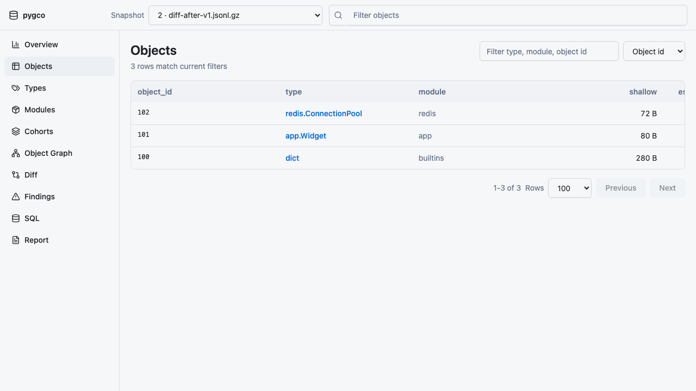
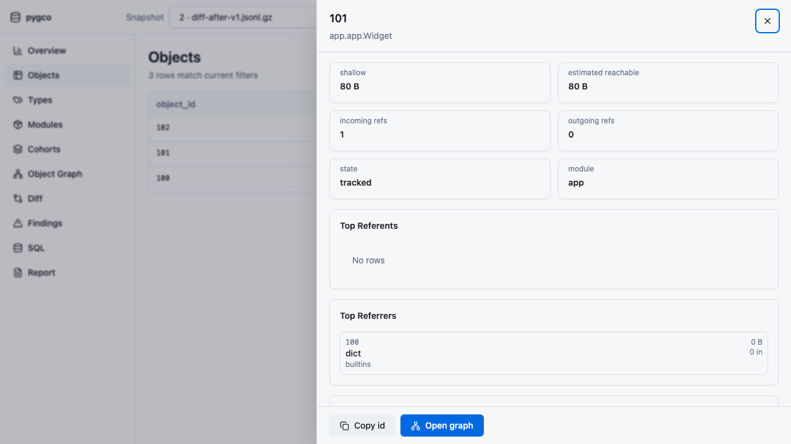
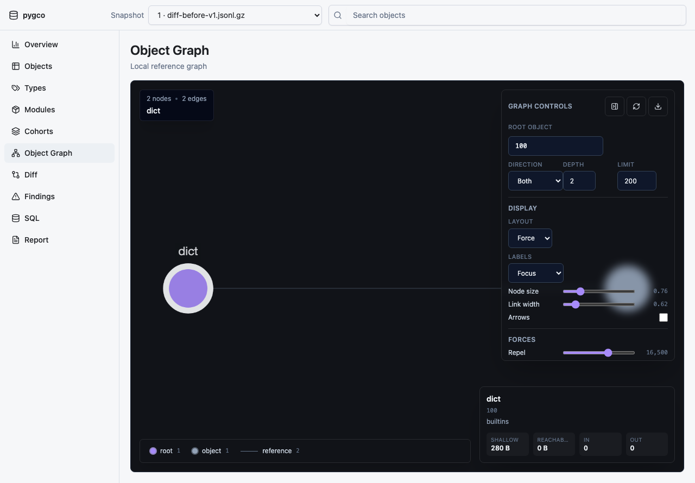
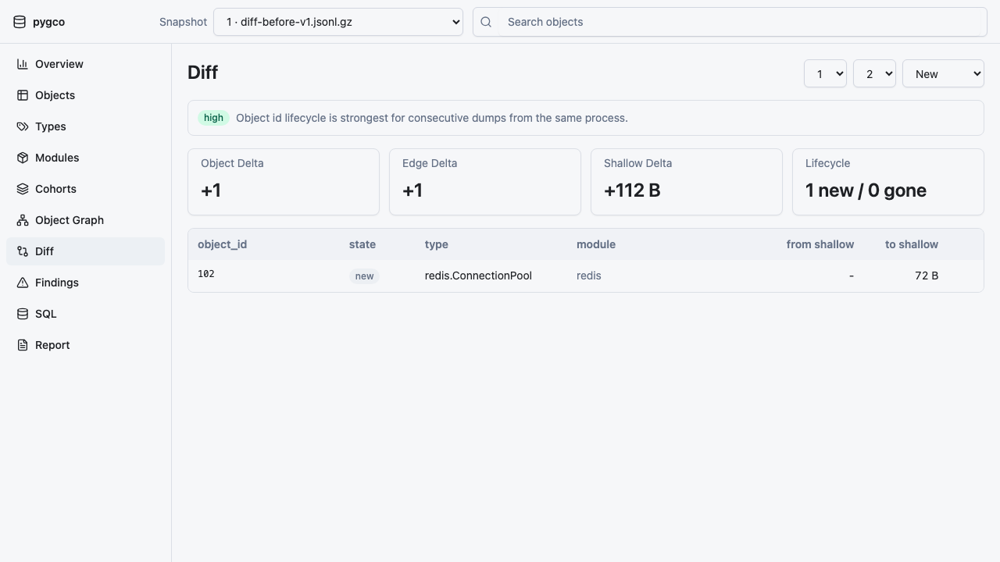
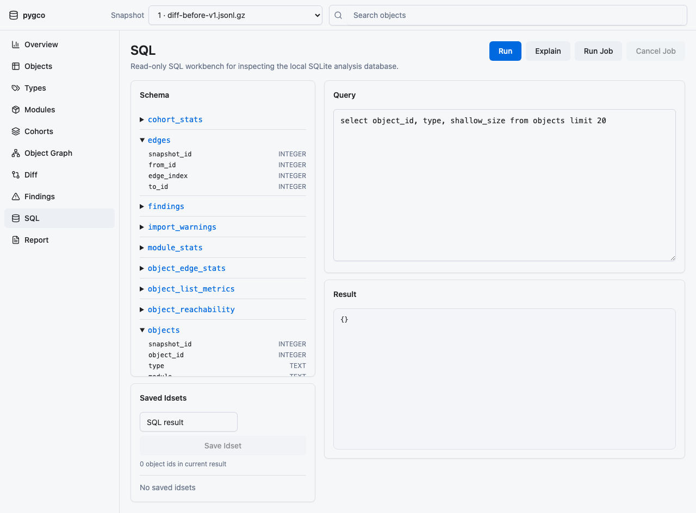
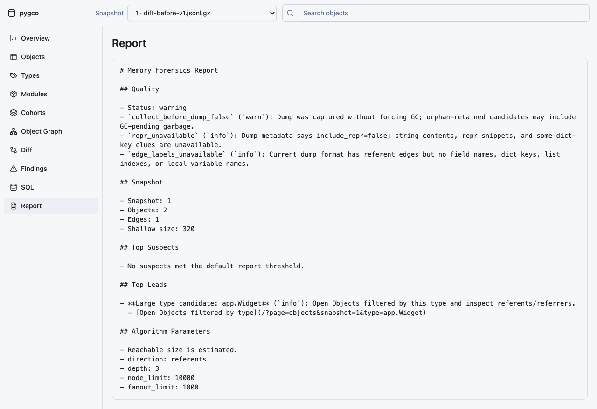

# Web UI Walkthrough

Screenshots can be regenerated from stable golden fixtures:

```bash
scripts/capture_web_screenshots.sh
```

The script writes PNG files to `docs/assets/web-ui/` by default. Review screenshots before committing them and do not use dumps that contain private data.

## Start

```bash
pygco open fixtures/golden/diff-before-v1.jsonl.gz fixtures/golden/diff-after-v1.jsonl.gz --no-browser
```

Open the printed local URL.

## Overview


Use Overview first to confirm:

- selected snapshot
- object count, edge count, shallow size
- top types/modules/cohorts
- warnings such as missing referents or unavailable reachability

The snapshot selector changes the active snapshot without rebuilding the SQLite file.

## Objects



Use Objects for the main exploration loop:

- sort by reachable size, shallow size, in edges, or out edges
- filter by text, type, module, cohort, stub state, and missing referents
- change page size and offset through URL state
- scan long type/module values without text collapsing into vertical words

Click a row to open object detail.

## Object Detail And Graph



Object detail shows:

- object metadata and size fields
- referents
- referrers
- owner path samples
- available actions

Open the local graph from the selected object. Graph queries use bounded depth, node, and edge limits. Missing edges and stub nodes have distinct styles and legend entries. Selecting an expandable node reloads the graph with that node as the root.



## Diff



When two snapshots are available, Diff shows aggregate deltas and lifecycle confidence. Use Diff Objects to inspect new, gone, retained, or changed rows. Low-confidence diffs should be treated as aggregate-first evidence.

## Findings

Findings are heuristic leads, not final diagnoses. Open evidence to inspect structured JSON and links back into Objects or related views.

## SQL And Idsets



SQL only accepts read-only `SELECT` or `WITH` queries. Use Explain before expensive queries. Save idsets from SQL or idset operations when comparing object groups across filters.

## Report



Report provides Markdown and JSON outputs with:

- summary
- findings
- algorithm parameters
- links back into the Web UI
